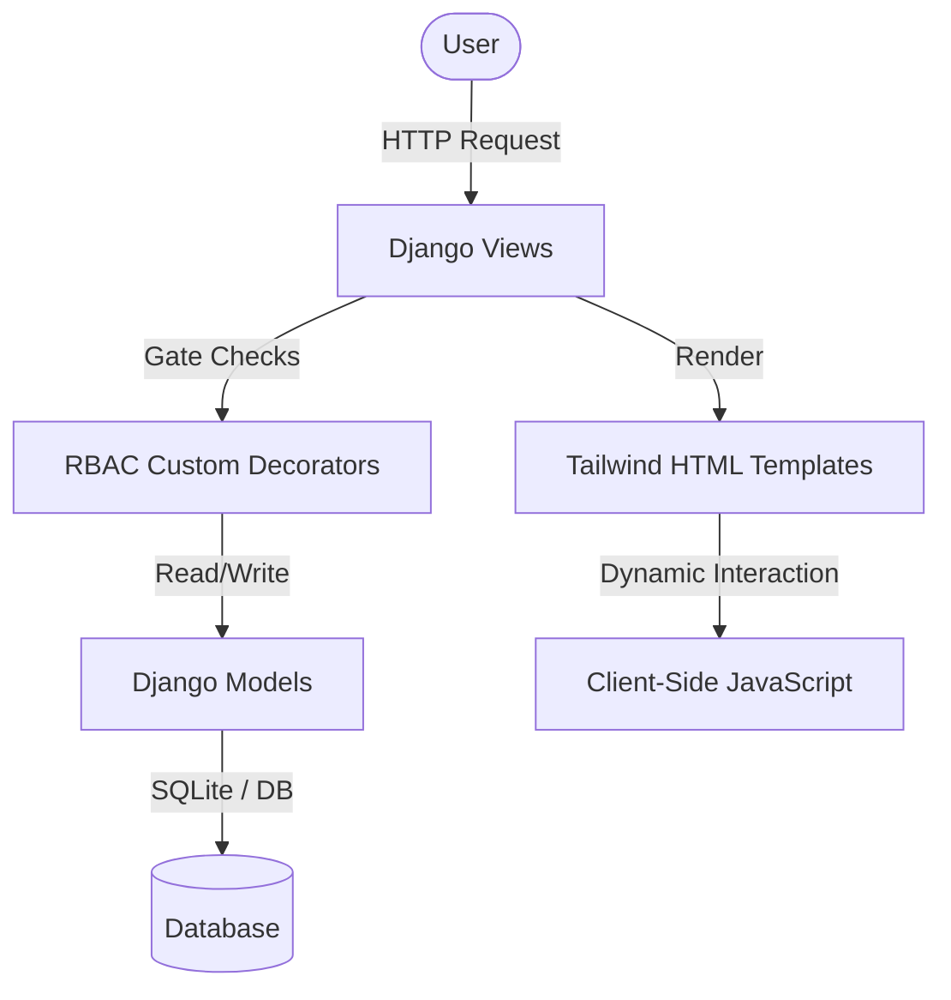

# AssetFlow Enterprise User Manual

Welcome to **AssetFlow**, a modern, premium, dark-themed Enterprise Asset & Resource Management System. This manual describes the project's purpose, enterprise value, architecture, operational workflow, and instructions on how to run and integrate it.

---

## 1. Project Purpose

AssetFlow is designed to solve the critical challenges of tracking, managing, and auditing physical and digital assets in an enterprise environment. It provides a cohesive, role-gated platform where departments can register equipment, allocate assets to employees, request transfers, book shared resources (like conference rooms or labs), coordinate equipment maintenance, and schedule compliance audits.

---

## 2. Enterprise Contributions & Solving Universal Problems

AssetFlow directly mitigates classic operational inefficiencies faced by large enterprises:

### A. The "Ghost Asset" Problem
- **Problem**: Companies continue paying insurance/depreciation on lost or stolen assets because the registry is outdated.
- **AssetFlow Solution**: Features a robust, structured **Audit Cycle** workflow. Missing items are automatically flagged and converted to a `LOST` status upon audit closure, ensuring accounting records remain accurate.

### B. Double Allocations and Scheduling Clashes
- **Problem**: Multiple employees claiming the same hardware or booking the same workspace simultaneously.
- **AssetFlow Solution**: Enforces a strict validation check:
  - Assets allocated to individuals cannot be double-allocated.
  - Shared bookable assets use an interval-overlap algorithm to ensure that time-slot bookings never conflict.

### C. Equipment Maintenance Downtime
- **Problem**: Hardware failures go unreported or take too long to resolve because of email-heavy tracking.
- **AssetFlow Solution**: A Kanban-style **Maintenance Board** transitions tickets systematically from `PENDING` -> `APPROVED` -> `TECHNICIAN_ASSIGNED` -> `IN_PROGRESS` -> `RESOLVED`, keeping key stakeholders updated via real-time notifications.

### D. Security & Role Escalation Prevention
- **Problem**: Unauthorized staff escalating their privileges to register/retire company property.
- **AssetFlow Solution**: Strict server-side Role-Based Access Control (RBAC) gates:
  - Public signups are strictly forced to the `EMPLOYEE` role.
  - Role promotion is restricted entirely to staff administrators.

---

## 3. Architecture & How the Application Works

AssetFlow is built as a self-contained Django application:



### Core Workflows

1. **Authentication & RBAC**:
   - Gated by custom `@role_required` decorators.
   - Roles include: `EMPLOYEE`, `DEPARTMENT_HEAD`, `ASSET_MANAGER`, and `ADMIN`.

2. **Asset Directory & Allocation**:
   - Assets are registered with unique tags (e.g., `AF-0001`), categories, locations, and conditions.
   - Standard allocation logs the holder (`User` or `Department`).
   - Transfer requests allow seamless, audited handovers of equipment directly between employees.

3. **Booking Timeline**:
   - Bookable assets feature a graphical timeline grid (from 08:00 to 18:00) powered by JSON payload serializers and canvas builders in JS.

4. **Kanban Maintenance Request**:
   - Standard employees raise maintenance tickets.
   - Managers approve and assign technicians. Flipped assets switch to `UNDER_MAINTENANCE` and return to `AVAILABLE` only when resolved.

5. **Audit Cycles**:
   - Admins define scopes (e.g. specific floors or departments).
   - Auditors mark items as `VERIFIED`, `MISSING`, or `DAMAGED`. Cycle closure locks results and updates registry states.

---

## 4. Run, Setup & Integration Guide

### Local Setup
1. **Activate Virtual Environment** (Windows PowerShell):
   ```powershell
   .\venv\Scripts\Activate.ps1
   ```
2. **Apply Database Migrations**:
   ```powershell
   python manage.py migrate
   ```
3. **Seed Demo Data**:
   Seed pre-configured departments, categories, assets, and users:
   ```powershell
   python manage.py seed_demo
   ```
4. **Run Server**:
   ```powershell
   python manage.py runserver
   ```

### Enterprise Integration Patterns
- **Identity Provider (IdP)**: Can be integrated with SAML, LDAP, or Active Directory by swapping Django's `AUTHENTICATION_BACKENDS`.
- **ERP Integration**: Integrate Django signals or custom REST API endpoints to sync acquisition data with ERP systems (like SAP or NetSuite).
- **Barcode / QR Scans**: Scan payloads map to `asset_detail` URLs: `/assets/<id>/` for fast warehouse audit updates.
